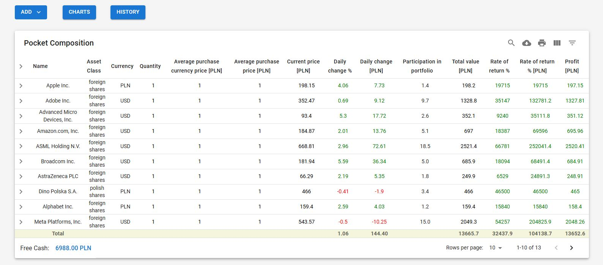
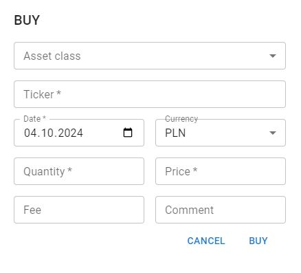
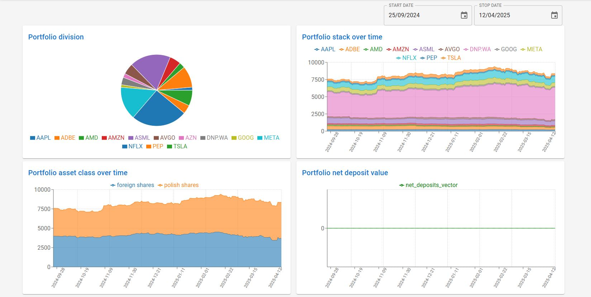

# FundTracker

Personal investment tracker: record operations, get positions, cash, and performance (TWR, XIRR, drawdown, benchmark comparison) derived from the ledger. FastAPI backend built as a layered modular monolith, React frontend.




## Features

- **Event ledger.** Buy, sell, deposit, withdrawal, dividend, interest, fee, split, bond interest. Positions and cash are rebuilt from history on every edit or delete; a change that breaks a rule is rejected.
- **Performance metrics.** TWR, XIRR, drawdown, net deposits, costs, dividends, free cash as daily vectors.
- **Benchmarks.** S&P 500, Nasdaq-100, WIG20 TR, modelled as assets of type `index` ([ADR-0023](docs/technical/adr/0023-benchmark-jako-asset-index.md)).
- **Polish treasury bonds.** Series terms from a public feed (manual override), bond interest operation.
- **Broker import.** XTB (`.xlsx`) and DM BOŚ (`.csv`): preview, reconciliation report, deduplication, revert per batch.
- **Multi-currency valuation.** Cross rates, explicit `rate_missing`, profit split into price and currency effect.
- **Market data.** Yahoo Finance prices and FX with stored source; split-unadjusted history.
- **`Decimal` everywhere** for money; `float`/NumPy only for chart vectors and XIRR.

| Operations | Charts |
|---|---|
|  |  |

## Engineering

- **Layers:** `api → services → repositories → infrastructure`, plus a pure `domain/` (ledger, valuation, snapshots; stdlib only).
- **Boundaries enforced** by an AST architecture test; cross-module calls only through services.
- **Transactions:** session per request, services own the commit (`repo.transaction()`); objects assembled only in `wiring.py`.
- **Ports & adapters:** `MarketDataProvider`, `BondDataProvider`, `ImportParser`; tests use fakes, no network.
- **Errors:** single `APIError` hierarchy, responses `{"detail", "code"}`.
- **CI:** ruff, `mypy --strict`, `alembic check`, pytest on PostgreSQL 16, frontend lint + build, Gitleaks, pip-audit, npm audit.
- **Tests:** ~900, including parity tests carried over from the earlier Django version.
- **Security:** JWT, bcrypt, rate limiting, switchable registration, CORS allow-list, admin-only shared data ([ADR-0012](docs/technical/adr/0012-jwt-odstepstwa-od-checklisty.md)).
- **Docs:** 22 technical + 7 business ADRs, glossary, module contracts — [knowledge map](docs/00_KNOWLEDGE-MAP.md) (in Polish).

## Stack

Python 3.14, FastAPI, Pydantic v2, SQLAlchemy 2, Alembic, PostgreSQL, NumPy/pandas, yfinance, openpyxl · React 19, TypeScript, Vite, MUI, TanStack Query/Table, Recharts.

## Getting started

Requires Python 3.14, Node.js 22, PostgreSQL.

```bash
# backend
python -m venv .venv && source .venv/Scripts/activate
cd backend
pip install -r requirements-dev.txt
# create backend/.env: DATABASE_URL, SECRET_KEY (optional: CORS_ORIGINS, ADMIN_EMAILS, REGISTRATION_ENABLED)
alembic upgrade head
python -m seed.seed
uvicorn app.main:app --reload      # API docs: http://localhost:8000/docs

# frontend
cd frontend
npm install
echo "VITE_API_URL=http://localhost:8000" > .env
npm run dev                        # http://localhost:5173
```

Checks: `ruff check . && ruff format --check . && mypy app && pytest` (backend, `pytest -m "not integration"` needs no database), `npm run lint && npm run build` (frontend).
