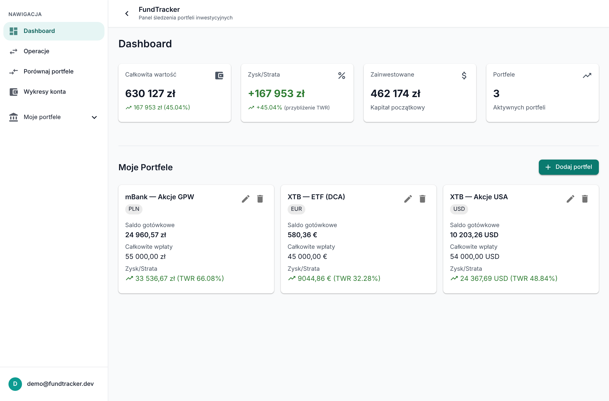
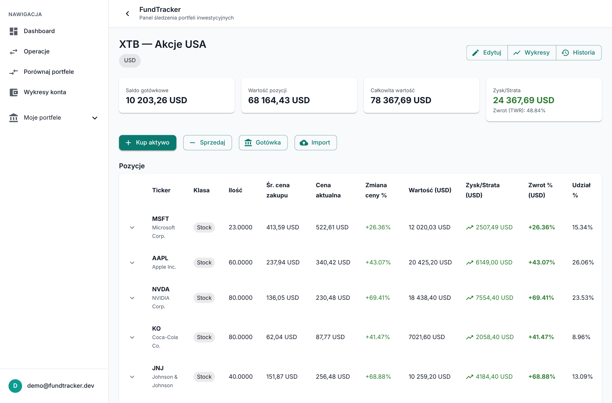
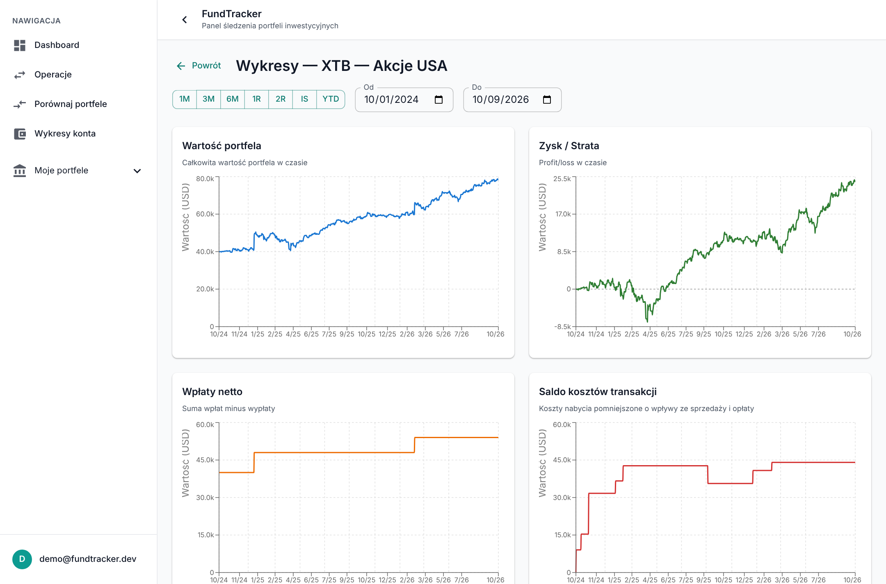
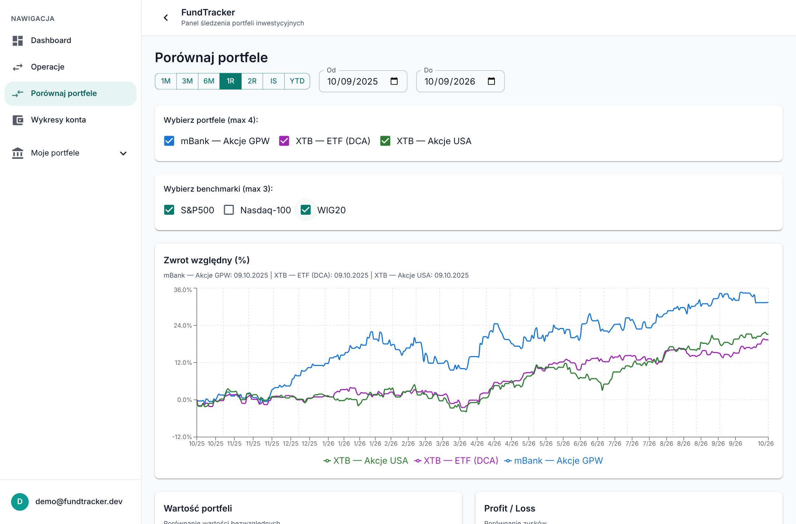
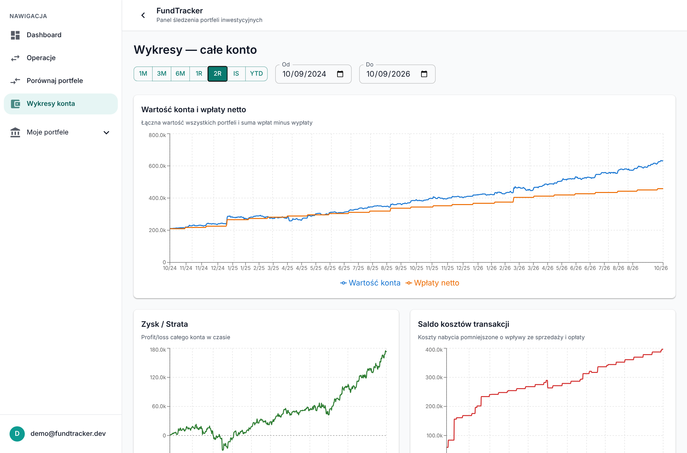

# FundTracker

**A self-hosted portfolio tracker for stocks, ETFs and bonds — built around correct return maths, not just pretty charts.**

Record what you buy, sell, deposit and receive; FundTracker derives positions, cash, realised and
unrealised P/L, time-weighted returns and daily history from that ledger, across currencies and
brokers. It started as a Django/React hobby project and was rewritten as a layered, test-guarded
FastAPI backend with a React 19 frontend.



> Screenshots show a demo dataset (three fictional portfolios on real market prices). The UI is in Polish.

## Highlights

- **Ledger as the source of truth.** Every state — positions, cash per currency, snapshots — is a
  pure function of the operations (buy, sell, deposit, withdrawal, dividend, interest, fee, split,
  bond interest) and can be rebuilt from scratch. Editing a past operation rebuilds from that day.
- **Honest performance numbers.** Daily time-weighted return (TWR), XIRR, cost basis on FIFO lots,
  multi-currency cash and valuation. A missing FX rate or price is flagged (`rate_missing`), never
  silently replaced by `1`. Methodology is written down in business ADRs and covered by golden-number tests.
- **Multiple portfolios, one account view.** Each portfolio is a brokerage account with its own
  base currency; the account view sums them in your reporting currency and compares them against
  benchmarks (S&P 500, Nasdaq-100, WIG20).
- **Market data pipeline.** Yahoo Finance prices and FX stored as dated, sourced history
  (unadjusted closes, manual overrides win), refreshed in the background with a daily claim so
  restarts and sleeping hosts catch up instead of duplicating work.
- **Broker import.** Port/adapter parsers (XTB, BOŚ) with a preview step, a reconciliation report
  against the portfolio state, and one-click revert of an import batch.
- **Polish treasury bonds.** Bond series terms (capitalisation, margin, reference rate) and interest operations.
- **Money is `Decimal`.** Amounts, prices, quantities and rates never touch `float` outside chart vectors.

## Screenshots

| Portfolio — positions, P/L, share of portfolio | Portfolio charts — value, P/L, net deposits |
|---|---|
|  |  |

| Compare portfolios and benchmarks (TWR) | Whole-account charts |
|---|---|
|  |  |

## Architecture

A **layered modular monolith**: four domain modules, each with the same internal structure, and
dependency rules that are enforced by an architecture test rather than by convention.

```
backend/app/
├── core/                    # settings, shared ports, error contract, Decimal schema
├── infrastructure/          # SQLAlchemy engine/session, Yahoo adapter, broker import parsers
└── modules/
    ├── security/            # login, JWT, password hashing
    ├── core_data/           # users
    ├── assets/              # currencies, assets, prices, FX history, bonds, market data
    └── portfolios/          # portfolios, positions, operations, metrics, snapshots, import
        ├── api/             #   thin routers
        ├── services/        #   use cases, own the transaction boundary
        ├── domain/          #   pure logic: ledger, FIFO, TWR — stdlib only, no ORM/clock
        ├── repositories/    #   persistence, never commits
        ├── schemas/ models/ #   Pydantic (extra="forbid") and SQLAlchemy
        ├── wiring.py        #   the only place objects are assembled
        └── entrypoints.py   #   non-HTTP operations (jobs, CLI)
frontend/src/                # React 19 · Vite · MUI · TanStack Query/Table · Recharts
```

Rules that keep it honest (checked by `core/tests/test_architecture.py`): API → services only,
services reach other modules only through their services, `domain/` imports nothing but the
standard library, repositories do not commit, services never see a `Session`.

Decisions are recorded, not folklore: **23 technical ADRs** and a set of business ADRs in
[`docs/`](docs/00_KNOWLEDGE-MAP.md) — one session per request, error contract with machine-readable
`code`, `Decimal` precision, FIFO lots, TWR methodology, daily snapshots and rebuild strategy,
background jobs as CLI, import architecture, and more. Start at the
[knowledge map](docs/00_KNOWLEDGE-MAP.md) or the [backend architecture](docs/technical/backend/01_backend-architecture.md).

## Tech stack

| Layer | Technology |
|---|---|
| Backend | Python 3.14, FastAPI, Pydantic 2, SQLAlchemy 2, Alembic, NumPy/pandas (XIRR, statistics) |
| Data | PostgreSQL, `yfinance` behind a `MarketDataProvider` port |
| Auth & safety | JWT (python-jose), bcrypt, `slowapi` rate limiting; deliberate deviations documented in [ADR-0012](docs/technical/adr/0012-jwt-odstepstwa-od-checklisty.md) |
| Frontend | React 19, TypeScript, Vite 7, MUI 7, TanStack Query & Table, Recharts, react-hook-form |
| Quality | ruff (lint + format), mypy `strict`, pytest (900+ test functions: unit, integration, architecture, parity), `alembic check` |
| CI | GitHub Actions: backend gates, frontend lint + build, `pip-audit` / `npm audit` |

## Run it locally

Requires Python 3.14, Node 20+ and PostgreSQL.

```bash
# backend
python -m venv .venv && source .venv/bin/activate
cd backend
pip install -r requirements-dev.txt
cp .env.example .env            # set DATABASE_URL and SECRET_KEY
alembic upgrade head
python -m seed.seed             # optional demo data (refuses staging/production)
uvicorn app.main:app --reload   # http://localhost:8000/docs

# frontend (second terminal)
cd frontend
echo "VITE_API_URL=http://localhost:8000" > .env
npm install
npm run dev                     # http://localhost:5173
```

Seeded login: `admin@foundtracker.com` / `admin`. Registration can be closed with `REGISTRATION_ENABLED=false`.

### Checks

```bash
cd backend && ruff check . && ruff format --check . && mypy app && alembic check
TEST_DATABASE_URL=postgresql://user:pw@localhost/found_tracker_test pytest   # or: pytest -m "not integration"
cd frontend && npm run lint && npm run build
```

## Roadmap

- Portfolio groups and further benchmarks per portfolio ([business ADR-0008](docs/business/adr/0008-benchmarki-wielokrotne.md))
- Reports: realised results, dividends over time, asset allocation
- More broker import adapters
- Scoring of companies for portfolio selection (idea stage)

## Project status

Personal project in active development; the backend rewrite from Django to FastAPI is complete,
and the remaining refactoring steps are tracked in the knowledge base.
