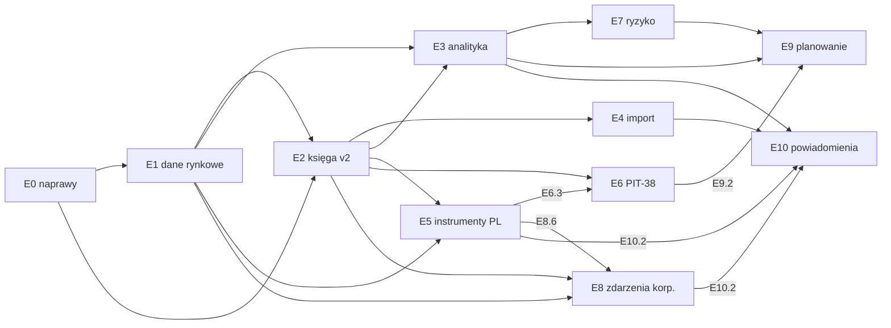

# Jak dojść od dzisiejszego FundTrackera do narzędzia lepszego niż myfund.pl?

Plan (L3) — **nie opisuje stanu systemu**; stan opisują dokumenty [L2](../technical/backend/01_backend-architecture.md) i kod. Podstawą planu są dowody L4 z 2026-10-01/02:

| Dowód | Co wnosi do planu |
|---|---|
| [myfund.pl — co oferuje i gdzie jest słaby](../research/competitors/01_myfund.md) | wzorzec zakresu funkcji (parytet) i lista słabości (przewaga) |
| [inne trackery — co przejąć](../research/competitors/02_trackery_porownanie.md) | najlepsze praktyki: metodologia PP, model danych Wealthfolio, import |
| [dane rynkowe PL i obligacje skarbowe](../research/03_rynek_pl_dane_i_obligacje.md) | źródła notowań, NBP, wzory wyceny obligacji z listów emisyjnych |
| [podatki PL i formaty brokerów](../research/04_rynek_pl_podatki_i_brokerzy.md) | reguły PIT-38 z cytatami ustawy, FIFO, art. 11a, IKE/IKZE, eksporty brokerów |
| [metodyka metryk](../research/05_metodyka_metryk.md) | TWR, XIRR, ryzyko, FIFO, snapshoty dzienne, testy złote |
| [stan FundTrackera vs cel](../research/06_stan_found-tracker_vs_cel.md) | defekty poprawności F1–F6 i luki G1–G25 |

Szczegóły kroków: [etapy E0–E5](./03_roadmapa_etapy_E0-E5.md) · [etapy E6–E11](./04_roadmapa_etapy_E6-E11.md).

> **Status.** Szkic (`draft`) do akceptacji przez właściciela. Kroki oznaczone „wymaga ADR” ruszają dopiero po zaakceptowaniu ADR-a (agent nie przełącza ADR-ów na `Accepted`). Szacunki pracochłonności są orientacyjne **[wniosek]**. Plan przeszedł niezależny przegląd (fakty, architektura, pokrycie funkcji myfund) 2026-10-02; poprawki są wprowadzone w tej wersji.

## 1. Założenia od właściciela (rozmowa 2026-10-01)

| Pytanie | Decyzja | Konsekwencja dla planu |
|---|---|---|
| Dla kogo? | **Tylko ja** — self-hosted, jeden użytkownik | Bez planów płatnych, portfeli publicznych, subskrypcji, forum. Rejestracja do zamknięcia (E0.6). `owner_id` zostaje |
| Rynek | **PL-first + globalne** | Domyślnie PLN, GPW/NewConnect, TFI, obligacje skarbowe, IKE/IKZE/PPK, PIT-38, NBP; równolegle zagranica i krypto |
| Dane rynkowe | **Darmowe źródła + ścieżka do płatnych** | Rejestr dostawców za portem; domyślnie NBP + Yahoo (`.WA` dla GPW — sprawdzone w [dowodzie](../research/03_rynek_pl_dane_i_obligacje.md)); Stooq (od 2026 z kluczem API) i płatne API jako adaptery opcjonalne |
| Forma wyniku | **Dokumenty w repo** | Ten plan + 6 dokumentów L4; ADR-y powstają przy kroku, którego dotyczą |

## 2. Co znaczy „lepiej niż myfund” — zasady produktowe

myfund wygrywa **szerokością polskich przypadków brzegowych**; przegrywa **UX-em, przejrzystością metodologii, niezawodnością importu, API i paywallem** ([dowód](../research/competitors/01_myfund.md)). FundTracker wygrywa jakością rdzenia, szerokość dokłada etapami.

| # | Zasada | Odpowiedź na słabość myfund | Kroki, które ją realizują |
|---|---|---|---|
| P1 | **Poprawność przed szerokością** — każda liczba ma metodę, testy złote i oznaczenie jakości danych | wątki „skąd różnice”, błędne stopy zwrotu i wyceny | E0, E1.7, E3.1, DoD pkt 3 |
| P2 | **Przejrzysta metodologia w UI** — metoda, okres, annualizacja, źródło kursów przy każdej liczbie | metoda opisana skrótowo w FAQ | E3.7; brak annualizacji < 1 roku (GIPS 2.A.12) |
| P3 | **Operacje są źródłem prawdy** — pozycje, partie, snapshoty, podatek da się odbudować | — | E2.0, DoD pkt 8 (test idempotencji `rebuild`) |
| P4 | **Import z podglądem i wycofaniem**, w tym przeniesienie historii z myfund | „godziny ręcznego poprawiania raportów” | E4.1–E4.3 (realizowane przed analityką, §3) |
| P5 | **Pełne API (odczyt i zapis)** i eksport wszystkiego | jeden endpoint read-only od 2025 | OpenAPI; E4.5, E10.4 |
| P6 | **Nowoczesny, czytelny UI** — kokpit → portfel → walor → operacja; mobile do przeglądania | „przeładowany, arkuszowy UI”, słabe mobile | E3.4, E3.8, E11.1, E11.8 |
| P7 | **Niezawodne dane** — wielu dostawców, oznaczenie cen nieaktualnych, ręczne nadpisanie | braki notowań i dywidend (2 223 wątki „Usterki”) | E1.2, E1.5, E1.7 |
| P8 | **Wszystko dostępne** — brak planów i limitów | analizy i podatki tylko w Expert | z definicji (single-user) |

## 3. Mapa etapów i kolejność realizacji

**Etapy** grupują kroki tematycznie; **kolejność realizacji** (niżej) jest inna, bo import i kilka tanich kroków muszą pojawić się wcześniej, żeby właściciel mógł przenieść swoje dane i używać aplikacji jak najszybciej.

| Etap | Nazwa | Co daje użytkownikowi | Parytet z myfund (plan) | Zależy od | Rozmiar **[wniosek]** |
|---|---|---|---|---|---|
| **E0** | Naprawy i ustawienia | wiarygodne liczby dla portfeli wielowalutowych; edycja operacji i dywidendy w UI; ustawienia użytkownika | — (higiena) | — | XL |
| **E1** | Dane rynkowe i historia | historia cen i kursów w bazie, NBP, wyszukiwanie po nazwie, benchmarki, odświeżanie w tle, kalendarz sesji | notowania, wyceny dzienne | E0 | XL |
| **E2** | Księga v2 | rachunki IKE/IKZE, gotówka wielowalutowa, nowe typy operacji, partie FIFO, zysk zrealizowany, snapshoty | operacje Basic | E0, E1 | XL |
| **E3** | Analityka podstawowa | TWR, XIRR, zysk w okresach, struktura, benchmark, kokpit, widok waloru, dywidendy | Basic/Standard | E1, E2 | XL |
| **E4** | Import i eksport | CSV, eksport myfund, XTB, mBank, IBKR, DEGIRO, Trading212, Revolut; kopia zapasowa | Pro (import) | E2.3 | XL |
| **E5** | Polskie instrumenty | obligacje skarbowe z wyceną z listów emisyjnych, TFI, PPK, lokaty, limity IKE/IKZE | Basic (PL) | E1, E2.4 | XL |
| **E6** | Podatki PIT-38 | rozliczenie roczne z partii FIFO i kursów NBP, dywidendy zagraniczne, krypto, straty, optymalizator | Expert (podatki) | E2.4, E1.2; E6.3 też E5 | XL |
| **E7** | Ryzyko i analityka zaawansowana | zmienność, Sharpe/Sortino, MDD, TUW, beta, VaR, kondycja portfela | Expert (statystyki, Snowball) | E3, E1.9 | XL |
| **E8** | Zdarzenia korporacyjne i dywidendy | prawa poboru, spin-off, zmiany tickera, propozycje dywidend, kalendarz i prognoza | Basic/Pro | E2, E1; E8.6 też E5.2 | XL |
| **E9** | Planowanie | portfel wzorcowy, rebalancing, cele, FIRE, Monte Carlo, operacje cykliczne | Expert (wzorce, cele) | E3, E7; E9.2 też E6 | L |
| **E10** | Powiadomienia i automatyzacja | alerty, raport e-mail, import z e-maila, token API, asystent AI | Pro (alerty) | E1, E3, E4; E10.2 też E5.2, E8.6 | XL |
| **E11** | Jakość i eksploatacja | PWA, UX, tryb prywatności, kopie, audyt, wydajność | — (przewaga) | ciągle | ciągły |

Rozmiary etapów wynikają z sumy kroków (S ≤ 1 dzień, M 2–4 dni, L 1–2 tyg., XL > 2 tyg.; jedna osoba, dni robocze). Czasy kamieni milowych są liczone z tej samej sumy, bez buforu.

### Kolejność realizacji i kamienie milowe

| Kamień | Kroki (w tej kolejności) | Kryterium akceptacji | Orientacyjnie **[wniosek]** |
|---|---|---|---|
| **M0 — rdzeń** | E0 → E1.1–E1.4 → E2.0–E2.5 + E8.1 (split ręczny) → E4.1, E4.2, E4.2a → E3.1 (bez TWR realnego — ten po E1.6) | Wprowadzam historię jednego rachunku z myfund/CSV; ilości walorów i salda gotówki zgadzają się **dokładnie** z wyciągiem brokera; TWR i XIRR liczą się z testami złotymi | 3–5 mies. |
| **M1 — używalny na co dzień** | E1.5–E1.9, E2.6–E2.7, E3.2–E3.8 (z E7.4), E5.6, E4.3 (brokerzy właściciela), E5.1 jeśli właściciel ma obligacje skarbowe | Prowadzę wszystkie swoje rachunki; wartość portfela przeliczona **cenami i kursami brokera** zgadza się z wyciągiem ±0,01 zł; widzę TWR/XIRR vs WIG, strukturę i dochód z dywidend | +3–4 mies. |
| **M2 — parytet z myfund (PL)** | E5 (reszta), E6 (cel: **luty 2027** — szkic PIT-38 za 2026), E4.4, E8.2–E8.6 | Obligacje skarbowe wyceniają się same (testy na Tabelach odsetkowych); PIT-38 części krajowej zgadza się z PIT-8C | +3–4 mies. |
| **M3 — lepszy niż myfund** | E7, E9, E10, E11 | pełna analityka ryzyka, planowanie, alerty, PWA | ciągle |

## 4. Decyzje do podjęcia (kandydaci na ADR)

Decyzje nieodwracalne lub zmieniające model danych. Rekomendacje pochodzą z dowodów; obowiązują dopiero po ADR-ze zaakceptowanym przez właściciela.

| # | Decyzja | Rekomendacja | Alternatywy | ADR | Blokuje |
|---|---|---|---|---|---|
| D1 | Czym jest Portfel względem rachunku maklerskiego? | **Portfel = jeden rachunek** (np. „XTB IKE”) z `account_type` (zwykły/IKE/IKZE/PPK/PPE/OIPE — odpowiednik `tax_wrapper` z [dowodu](../research/04_rynek_pl_podatki_i_brokerzy.md)) i `broker`; agregacja przez **Grupę portfeli** | osobny byt Rachunek w Portfelu (rekomendacja dowodu 04, model myfund) — bogatszy, trudniejszy w UI | biznesowy | E2.1, E6 |
| D2 | Koszt nabycia | **Partie zakupu jako dane pochodne; FIFO domyślnie w obrębie Portfela (= rachunku)**; wskazanie konkretnej partii, gdy broker ją identyfikuje (art. 24 ust. 10 stosuje FIFO, gdy nie da się określić ceny nabycia — [dowód](../research/04_rynek_pl_podatki_i_brokerzy.md)); średnia cena tylko do prezentacji | sama średnia (dziś) | biznesowy | E2.4, E6 |
| D3 | Słownik | dodać do [`CONTEXT.md`](../business/CONTEXT.md): **Partia**, Grupa portfeli, Przelew, Przewalutowanie, Kurs podatkowy, Typ rachunku (dziś „lot”, „transfer”, „rachunek” są na listach _Unikać_) | „lot”, „transza” | biznesowy (+ CONTEXT) | E2.1–E2.4 |
| D4 | Gotówka wielowalutowa | **saldo per (Portfel, Waluta)** + przewalutowanie; ADR zawiera regułę reinterpretacji `fx_rate` istniejących operacji i nową bazę testów parytetu | jedno saldo w walucie bazowej (dziś) | biznesowy | E2.2 |
| D5 | Kursy walut | **trzy kursy na zdarzenie**: brokera, wyceny (dzienny), podatkowy (NBP tabela A z ostatniego dnia roboczego przed dniem przychodu/kosztu, art. 11a; zapisany z numerem tabeli) | jeden kurs ręczny (dziś) | techniczny | E1.2, E2.3, E6 |
| D6 | Metodologia stóp zwrotu | **TWR dzienny (konwencja PP) + XIRR**; brak annualizacji < 365 dni; ryzyko z szeregu TWR; klasyfikacja przepływów zależna od zakresu (Portfel / Grupa) | jednostki jak w funduszu (myfund) — równoważne TWR | biznesowy | E3.1 |
| D7 | Historia cen i snapshoty | tabele `assets_price`, `assets_fx_rate` (ceny **nieskorygowane**, źródło, `is_synthetic`) oraz `portfolios_daily`, `portfolios_position_daily`; `twr_index` jako `Decimal`. **Unieważnianie orkiestruje `portfolios`** (entrypoint porównuje znacznik `last_price_change_at` z `assets`) — `assets` nie zależy od `portfolios` ([ADR-0006](../technical/adr/0006-cross-module-wylacznie-przez-serwisy.md)) | liczenie na żądanie z dostawcy (dziś) | techniczny | E1.1, E2.5 |
| D8 | Zadania w tle | **CLI `python -m app.cli <zadanie>` przez `entrypoints.py` + harmonogram systemowy** (cron/systemd/kontener), zgodnie z ADR-0002 | Celery/Redis — za ciężkie | techniczny | E1.4 |
| D9 | Model Operacji | **płaska Operacja**: `operation_date` = data zawarcia; pola: `settlement_date`, `currency_id`, `fx_rate_tax` (+ tabela, data), `counter_portfolio_id`, `counter_amount`, `counter_currency_id`, `import_batch_id`, `external_ref`, `status` (zaksięgowana/szkic/unieważniona), `sequence` | nagłówek + nogi (PP/Wealthfolio) | techniczny | E2.3 |
| D10 | Moduły | nowe: `taxes`, `planning`, `notifications`; **import w `portfolios`** (tabela paczek importu (`import_batch`) i parsery jako adaptery w `infrastructure/`) — moduł `imports` tylko, jeśli nie powstaje cykl FK; obligacje i szeregi stóp w `assets`; wydajność i ryzyko w `portfolios` | moduł „analytics” — nazwa zakazana w [CONTEXT](../business/CONTEXT.md) | techniczny | E4, E6, E9, E10 |
| D11 | float w statystykach | statystyki ryzyka, XIRR i Monte Carlo na `float` (numpy w `services/`), księga i `twr_index` na `Decimal` — **wymaga uzupełnienia [ADR-0010](../technical/adr/0010-decimal-i-precyzja-pieniedzy.md)** (dziś float tylko w wektorach wykresów) | numpy w `domain/` | techniczny | E3.1, E7, E9.5 |
| D12 | Data zdarzenia podatkowego | Operacja ma datę zawarcia (`operation_date`) i `settlement_date`; **podatek i kurs D−1 liczone od daty rozrachunku** (art. 17 ust. 1ab — przeniesienie własności, [dowód](../research/04_rynek_pl_podatki_i_brokerzy.md)), z ustawieniem per rachunek; dywidenda — dzień wypłaty | data zawarcia transakcji | biznesowy | E2.3 |
| D13 | Daty i strefa czasowa | `operation_date` jako **data kalendarzowa w strefie Europe/Warsaw** + opcjonalna godzina i `sequence` do kolejności w dniu; snapshoty dzienne w tej samej strefie | znacznik czasu UTC (dziś, bez godziny z UI) | techniczny | E2.0, E2.3 |
| D14 | Własność danych referencyjnych | walory, ceny ręczne, tagi i benchmarki globalne w instancji (single-user), zapisy tylko dla właściciela; rejestracja zamknięta (E0.6 — konfiguracja, bez ADR) | dane per użytkownik | techniczny | E1.5 |
| D15 | Semantyka usuwania | walor z historią cen lub operacjami — tylko archiwizacja; paczka importu — cofnięcie usuwa jej operacje, chyba że były edytowane (wtedy blokada z listą); Portfel z przelewami — blokada lub kaskadowe przeliczenie powiązanych | twarde usuwanie z kaskadą | techniczny | E2.3, E4.1 |
| D16 | Migracje danych | migracje schematu tylko `autogenerate`; nowe kolumny nullable albo z `server_default`; **dane istniejące wypełnia komenda `rebuild-all`** (`portfolios/entrypoints.py`) | ręczna edycja migracji (zakazana) | techniczny | E2.0 |

## 5. Definicja ukończenia kroku (wspólna)

1. Zgodność z architekturą (warstwy, `wiring.py`, `transaction()`, błędy z `code`, `Decimal`, `extra="forbid"`, `domain/` bez I/O); test architektury zielony.
2. Migracje wyłącznie `alembic revision --autogenerate`; `alembic check` bez dryfu; model w `models_registry.py`; **istniejące dane przebudowane** (`rebuild-all`, D16).
3. Testy: jednostkowe domeny bez bazy z **testami złotymi** z L4; integracyjne endpointów; testy własności dla obliczeń.
4. `ruff check .`, `ruff format --check .`, `mypy app`, `pytest`; frontend `npm run lint`, `npm run build`.
5. Funkcja dostępna w UI ze stanami: pusty, błąd, ładowanie.
6. Dokumentacja: dokument modułu L2 („Stan vs cel”), nowe pojęcia w `CONTEXT.md`, mapa wiedzy, `kb_validate --strict` bez nowych błędów.
7. Testy parytetu `portfolios/tests/unit/test_ledger_parity.py` zielone — chyba że krok świadomie zmienia regułę (ADR + nowa baza testu w tym samym kroku).
8. Dla danych pochodnych: test idempotencji — `rebuild()` dwukrotnie daje identyczny stan.

## 6. Ryzyka

| Ryzyko | Wpływ | Mitygacja |
|---|---|---|
| Darmowi dostawcy zmieniają API (Stooq od 2026 wymaga klucza; Yahoo nieoficjalne) | brak cen | rejestr dostawców z fallbackiem; ceny w bazie; ręczne ceny; płatny adapter (E1.2) |
| Ceny dostawcy skorygowane o splity/dywidendy | podwójne ujęcie splitu | jawne pobieranie cen nieskorygowanych + test kontraktowy na walorze po splicie (E1.2) |
| Licencje danych GPW (redystrybucja = 9× stawka) | ryzyko prawne przy udostępnianiu | użytek własny, bez publikacji danych ([dowód](../research/03_rynek_pl_dane_i_obligacje.md)) |
| Błędna interpretacja przepisów | błędne PIT-38 | eksport „szkic do weryfikacji”; testy na broszurze MF i PIT-8C; cytaty przepisów w dokumentacji |
| Rozrost E2 | opóźnienie wszystkiego | kroki E2.0–E2.7 z migracją addytywną i zielonymi testami parytetu |
| Zmiana metodologii po wdrożeniu | utrata zaufania | ADR D6 przed E3; pole `method` w odpowiedziach API |
| Wydajność przeliczeń | wolne wykresy | snapshoty (D7); pomiar na zbiorze 10 lat × 200 operacji × 30 walorów |
| Praca jednoosobowa | porzucenie | M0 jako mały, użyteczny rdzeń; eksport w otwartym formacie (E4.5) |

## 7. Poza zakresem (świadomie)

| Pomijamy | Dlaczego |
|---|---|
| Portfele publiczne i subskrybowane, forum, ranking funduszy, skaner spółek, analiza fundamentalna, sygnały AT i strategie | funkcje społecznościowe/serwisowe dla szerokiej bazy płacących ([dowód](../research/competitors/01_myfund.md)) |
| Kontrakty terminowe, Forex/CFD, opcje, krótka sprzedaż | inny model ryzyka i depozytu; właściciel ich nie zgłosił |
| OFE, pożyczki społecznościowe, nieruchomości z najmem, zobowiązania i majątek netto, budżet domowy, PSD2 | poza celem „tracker inwestycji”; zobowiązania można dodać później jako E9.7 |
| Portfel bliźniaczy, wykresy śróddzienne, synchronizacja przez API XTB, import od dostawców PPK/TFI przez wtyczkę przeglądarki | niski stosunek wartości do kosztu dla jednego użytkownika; import plików (E4) pokrywa potrzebę |
| Wymienne strategie kosztu (LIFO/HIFO) poza „co by było”, zaszyfrowany plik + aplikacja mobilna tylko do odczytu | prawo wymaga FIFO lub identyfikacji partii (D2); PWA (E11.1) zamiast osobnej aplikacji |

## 8. Kolejne kroki po akceptacji planu

1. Właściciel akceptuje lub zmienia decyzje D1–D16; agent przygotowuje ADR-y `Proposed` (biznesowe w `docs/business/adr/`, techniczne w `docs/technical/adr/`).
2. Start od **E0** — naprawy nie wymagają nowych ADR-ów, a usuwają defekty F1–F6, które zafałszowałyby każdą metrykę.
3. Po każdym kamieniu milowym przegląd planu (ten plik); stan systemu opisuje L2.
