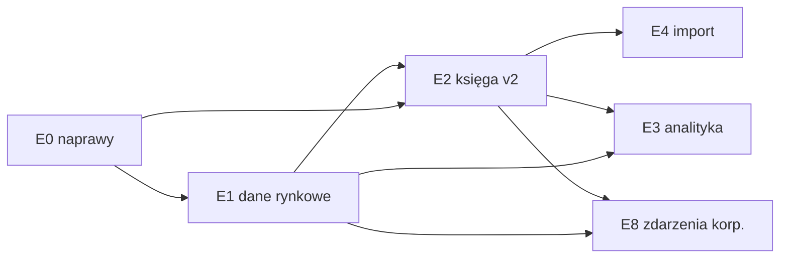

# Jak dojść od dzisiejszego FundTrackera do narzędzia lepszego niż myfund.pl?

Plan (L3) — **nie opisuje stanu systemu**; stan opisują dokumenty [L2](../technical/backend/01_backend-architecture.md) i kod. Podstawą planu są dowody L4 z 2026-10-01/02:

| Dowód | Co wnosi do planu |
|---|---|
| [myfund.pl — co oferuje i gdzie jest słaby](../research/competitors/01_myfund.md) | wzorzec zakresu funkcji (parytet) i lista słabości (przewaga) |
| [inne trackery — co przejąć](../research/competitors/02_trackery_porownanie.md) | najlepsze praktyki: metodologia PP, model danych Wealthfolio, import |
| [dane rynkowe PL](../research/03_rynek_pl_dane_rynkowe.md) | źródła notowań i kursów NBP |
| [formaty eksportu brokerów](../research/04_rynek_pl_brokerzy.md) | eksporty XTB i innych brokerów |
| [metodyka metryk](../research/05_metodyka_metryk.md) | TWR, XIRR, benchmark, FIFO, snapshoty dzienne, testy złote |
| [stan FundTrackera vs cel](../research/06_stan_found-tracker_vs_cel.md) | defekty poprawności F1–F6 i luki G1–G25 |

Szczegóły kroków: [etapy E0–E4](./03_roadmapa_etapy_E0-E5.md) · [etapy E8 i E11](./04_roadmapa_etapy_E6-E11.md).

> **Status.** Szkic (`draft`) do akceptacji przez właściciela. Kroki oznaczone „wymaga ADR” ruszają dopiero po zaakceptowaniu ADR-a (agent nie przełącza ADR-ów na `Accepted`). Szacunki pracochłonności są orientacyjne **[wniosek]**.

> **Numeracja.** Etapy i decyzje D mają luki (brak E5–E7, E9, E10 oraz D12); nie renumerujemy, żeby odwołania w ADR-ach, schematach i kontrakcie pozostały stabilne.

## 1. Założenia od właściciela

| Pytanie | Decyzja | Konsekwencja dla planu |
|---|---|---|
| Dla kogo? | **Tylko ja** — jeden użytkownik (właściciel) | Bez planów płatnych, portfeli publicznych, subskrypcji, forum. Rejestracja zamknięta (E0.6). `owner_id` zostaje |
| Hosting | Backend na Render (usypia się), Postgres na Supabase (pooler transakcyjny) | Zadania w tle muszą nadrabiać zaległości po wybudzeniu (E1.4); bez blokad sesyjnych |
| Instrumenty | **Akcje i ETF-y**, broker XTB; GPW i zagranica | Domyślnie PLN; ceny ręczne tylko awaryjnie (`source=manual`) |
| Dane rynkowe | Yahoo (ceny; `.WA` dla GPW — sprawdzone w [dowodzie](../research/03_rynek_pl_dane_rynkowe.md)) + NBP (kursy walut) | Rejestr dostawców za portem; kolejne adaptery opcjonalnie |
| Dane | **Od zera** — bez migracji istniejących danych | Dane przez seed i import; migracje schematu tylko `autogenerate` |
| Forma wyniku | **Dokumenty w repo** | Ten plan + 6 dokumentów L4; ADR-y powstają przy kroku, którego dotyczą |

## 2. Co znaczy „lepiej niż myfund” — zasady produktowe

myfund wygrywa **szerokością polskich przypadków brzegowych**; przegrywa **UX-em, przejrzystością metodologii, niezawodnością importu, API i paywallem** ([dowód](../research/competitors/01_myfund.md)). FundTracker wygrywa jakością rdzenia, szerokość dokłada etapami.

| # | Zasada | Odpowiedź na słabość myfund | Kroki, które ją realizują |
|---|---|---|---|
| P1 | **Poprawność przed szerokością** — każda liczba ma metodę, testy złote i oznaczenie jakości danych | wątki „skąd różnice”, błędne stopy zwrotu i wyceny | E0, E1.7, E3.1, DoD pkt 3 |
| P2 | **Przejrzysta metodologia w UI** — metoda, okres, annualizacja, źródło kursów przy każdej liczbie | metoda opisana skrótowo w FAQ | E3.7; brak annualizacji < 1 roku (GIPS 2.A.12) |
| P3 | **Operacje są źródłem prawdy** — pozycje, partie i snapshoty da się odbudować | — | E2.0, DoD pkt 8 (test idempotencji `rebuild`) |
| P4 | **Import z cofnięciem** (XTB jako pierwszy adapter, później) | „godziny ręcznego poprawiania raportów” | E4 |
| P5 | **Pełne API (odczyt i zapis)** | jeden endpoint read-only od 2025 | OpenAPI |
| P6 | **Nowoczesny, czytelny UI** — kokpit → portfel → walor → operacja; mobile do przeglądania | „przeładowany, arkuszowy UI”, słabe mobile | E3.4, E3.8, E11.1, E11.8 |
| P7 | **Niezawodne dane** — oznaczenie cen nieaktualnych, ręczne nadpisanie awaryjne | braki notowań i dywidend (2 223 wątki „Usterki”) | E1.2, E1.5, E1.7 |
| P8 | **Wszystko dostępne** — brak planów i limitów | analizy tylko w Expert | z definicji (single-user) |

## 3. Mapa etapów i kolejność realizacji

**Etapy** grupują kroki tematycznie; **kolejność realizacji** (niżej) jest inna, bo kilka tanich kroków musi pojawić się wcześniej, żeby właściciel mógł używać aplikacji jak najszybciej.

| Etap | Nazwa | Co daje użytkownikowi | Parytet z myfund (plan) | Zależy od | Rozmiar **[wniosek]** |
|---|---|---|---|---|---|
| **E0** | Naprawy i ustawienia | wiarygodne liczby dla portfeli wielowalutowych; edycja operacji i dywidendy w UI; ustawienia użytkownika | — (higiena) | — | XL |
| **E1** | Dane rynkowe i historia | historia cen i kursów w bazie, NBP, wyszukiwanie po nazwie, benchmark, odświeżanie w tle z nadrabianiem po wybudzeniu, kalendarz sesji | notowania, wyceny dzienne | E0 | XL |
| **E2** | Księga v2 | Portfel jako rachunek, Grupy portfeli, gotówka wielowalutowa, nowe typy operacji, partie FIFO, zysk zrealizowany, snapshoty | operacje Basic | E0, E1 | XL |
| **E3** | Analityka podstawowa | TWR, XIRR, zysk w okresach, struktura, benchmark, kokpit, widok waloru, dywidendy | Basic/Standard | E1, E2 | XL |
| **E4** | Import | port parsera, paczki importu z cofnięciem, adapter XTB (później) | Pro (import) | E2.3 | L |
| **E8** | Zdarzenia korporacyjne i dywidendy | split, zmiany tickera, spin-off, prawa poboru, propozycje dywidend, kalendarz i prognoza | Basic/Pro | E2, E1 | XL |
| **E11** | Jakość i eksploatacja | PWA, UX, tryb prywatności, audyt, wydajność | — (przewaga) | ciągle | ciągły |

Rozmiary etapów wynikają z sumy kroków (S ≤ 1 dzień, M 2–4 dni, L 1–2 tyg., XL > 2 tyg.; jedna osoba, dni robocze). Czasy kamieni milowych są liczone z tej samej sumy, bez buforu.

### Kolejność realizacji i kamienie milowe

| Kamień | Kroki (w tej kolejności) | Kryterium akceptacji | Orientacyjnie **[wniosek]** |
|---|---|---|---|
| **M0 — rdzeń** | E0 → E1.1–E1.4 → E2.0–E2.5 + E8.1 (split ręczny) → E3.1 | Wprowadzam historię jednego rachunku ręcznie; ilości walorów i salda gotówki zgadzają się **dokładnie** z wyciągiem brokera; TWR i XIRR liczą się z testami złotymi | 2–4 mies. |
| **M1 — używalny na co dzień** | E1.5–E1.9, E2.6–E2.7, E3.2–E3.8, E4 (import XTB, gdy właściciel zdecyduje) | Prowadzę wszystkie swoje rachunki; wartość portfela przeliczona **cenami i kursami brokera** zgadza się z wyciągiem ±0,01 zł; widzę TWR/XIRR vs benchmark, strukturę i dochód z dywidend | +2–3 mies. |
| **M2 — zdarzenia korporacyjne** | E8.2–E8.6 | Splity, zmiany tickerów i dywidendy nie psują historii ani stóp zwrotu | +1–2 mies. |
| **M3 — jakość** | E11 | PWA, tryb prywatności, wydajność w budżecie | ciągle |

## 4. Decyzje do podjęcia (kandydaci na ADR)

Decyzje nieodwracalne lub zmieniające model danych. Rekomendacje pochodzą z dowodów; obowiązują dopiero po ADR-ze zaakceptowanym przez właściciela.

| # | Decyzja | Rekomendacja | Alternatywy | ADR | Blokuje |
|---|---|---|---|---|---|
| D1 | Czym jest Portfel względem rachunku maklerskiego? | **Portfel = jeden rachunek** (np. „XTB”); `account_type` i `broker` to wyłącznie etykiety informacyjne; agregacja przez **Grupę portfeli** (bez własnych operacji) | osobny byt Rachunek w Portfelu (model myfund) — bogatszy, trudniejszy w UI | biznesowy | E2.1 |
| D2 | Koszt nabycia | **Partie zakupu jako dane pochodne; FIFO w obrębie Portfela (= rachunku)**; średnia cena tylko do prezentacji; split zachowuje koszt łączny | sama średnia (dziś) | biznesowy | E2.4 |
| D3 | Słownik | dodać do [`CONTEXT.md`](../business/CONTEXT.md): **Partia**, Grupa portfeli, Przewalutowanie (dziś „lot” i „rachunek” są na listach _Unikać_) | „lot”, „transza” | biznesowy (+ CONTEXT) | E2.1–E2.4 |
| D4 | Gotówka wielowalutowa | **saldo per (Portfel, Waluta)** + przewalutowanie jako operacja (prowizja w walucie wychodzącej); dywidenda trafia na saldo w walucie wypłaty; opcjonalne `auto_funding` per Portfel (domyślnie wyłączone) | jedno saldo w walucie bazowej (dziś) | biznesowy | E2.2 |
| D5 | Kursy walut | **dwa kursy**: brokera (`fx_rate` w Operacji) i wyceny (dzienny z `assets_fx_rate`, źródło NBP) | jeden kurs ręczny (dziś) | techniczny | E1.2, E2.3 |
| D6 | Metodologia stóp zwrotu | **TWR dzienny (konwencja PP) + XIRR**; brak annualizacji < 365 dni; benchmark: jeden indeks; zakres (Portfel / Grupa) | jednostki jak w funduszu (myfund) — równoważne TWR | biznesowy | E3.1 |
| D7 | Historia cen i snapshoty | tabele `assets_price`, `assets_fx_rate` (ceny **nieskorygowane**, źródło, `is_synthetic`) oraz `portfolios_daily`, `portfolios_position_daily`; `twr_index` jako `Decimal`; przebudowa per Portfel. **Unieważnianie orkiestruje `portfolios`** (entrypoint czyta dziennik zmian cen; szczegóły — [ADR-0016](../technical/adr/0016-snapshoty-dzienne-i-przebudowa.md)) — `assets` nie zależy od `portfolios` ([ADR-0006](../technical/adr/0006-cross-module-wylacznie-przez-serwisy.md)) | liczenie na żądanie z dostawcy (dziś) | techniczny | E1.1, E2.5 |
| D8 | Zadania w tle | **CLI `python -m app.cli <zadanie>` przez `entrypoints.py`** jako wspólna implementacja + **nadrabianie zaległości po wybudzeniu** (pierwsze żądanie dnia rejestruje w `BackgroundTasks` odświeżenie cen/kursów i przebudowę zaległych dni; idempotentne); ochrona przed równoległym przebiegiem: blokada w transakcji w bazie (tabela `job_run`), nie `flock` ani blokady sesyjne; zewnętrzny harmonogram opcjonalny | Celery/Redis — za ciężkie | techniczny | E1.4 |
| D9 | Model Operacji | **płaska Operacja**: `operation_day`, `sequence`, `currency_id`, `import_batch_id`, `external_ref`, `status` (zaksięgowana/szkic/unieważniona) | nagłówek + nogi (PP/Wealthfolio) | techniczny | E2.3 |
| D10 | Moduły | `core_data`, `security`, `assets`, `portfolios`; **import w `portfolios`** (tabela paczek importu (`import_batch`) i parsery jako adaptery w `infrastructure/`); wydajność w `portfolios`, benchmark w `assets` | moduł „analytics” — nazwa zakazana w [CONTEXT](../business/CONTEXT.md) | techniczny | E4 |
| D11 | float w statystykach | XIRR i statystyki benchmarku na `float` (numpy w `services/`), księga, TWR i kursy na `Decimal` — **wymaga uzupełnienia [ADR-0010](../technical/adr/0010-decimal-i-precyzja-pieniedzy.md)** (dziś float tylko w wektorach wykresów) | numpy w `domain/` | techniczny | E3.1 |
| D13 | Daty i strefa czasowa | `operation_day` jako **data kalendarzowa w strefie Europe/Warsaw** + `sequence` do kolejności w dniu; snapshoty dzienne w tej samej strefie | znacznik czasu UTC (dziś, bez godziny z UI) | biznesowy + techniczny | E2.0, E2.3 |
| D14 | Własność danych referencyjnych | walory, ceny ręczne i benchmarki globalne w instancji (single-user), zapisy tylko dla właściciela; rejestracja zamknięta (E0.6 — konfiguracja, bez ADR) | dane per użytkownik | biznesowy | E1.5 |
| D15 | Semantyka usuwania | walor z historią cen lub operacjami — tylko archiwizacja; paczka importu — cofnięcie usuwa jej operacje, chyba że były edytowane (wtedy blokada z listą) | twarde usuwanie z kaskadą | biznesowy | E2.3, E4.1 |
| D16 | Dane i migracje | migracje schematu tylko `autogenerate`; nowe kolumny nullable albo z `server_default`; dane od zera przez seed i import | ręczna edycja migracji (zakazana) | techniczny | E2.0 |

### Dokumenty projektowe i ADR-y (biznesowe i techniczne 0013–0017, 0019–0020 `Accepted`; 0018 `Proposed`)

Plan mówi **co** i **w jakiej kolejności**; **jak** (kolumny, endpointy, ekrany, algorytmy) opisują dokumenty projektowe.

| Dokument | Zakres |
|---|---|
| [schemat danych](../technical/backend/07_schemat_danych_docelowy.md) | tabele i kolumny core_data, assets, portfolios (w tym paczki importu i `job_run`): dziś → docelowo, migracje |
| [kontrakt API](../technical/backend/09_kontrakt_api_docelowy.md) | ścieżki, parametry, koperty, paginacja, kody błędów |
| [IA i konwencje UI](../technical/frontend/ia-i-konwencje-ui.md) | trasy, nawigacja, formatowanie, flagi jakości danych |

Mapa decyzji D na ADR-y (biznesowe 0001–0005 i 0007, techniczne 0013–0020):

| Decyzja | ADR |
|---|---|
| D1 | [biznesowy 0001 — Portfel jest rachunkiem](../business/adr/0001-portfel-jest-rachunkiem.md) |
| D2, D3 | [biznesowy 0002 — koszt nabycia, partie FIFO](../business/adr/0002-koszt-nabycia-partie-fifo.md) |
| D4 | [biznesowy 0003 — gotówka wielowalutowa](../business/adr/0003-gotowka-wielowalutowa.md) |
| D6 | [biznesowy 0004 — metodologia stóp zwrotu](../business/adr/0004-metodologia-stop-zwrotu.md) |
| D13 | [biznesowy 0005 — daty operacji: dzień i kolejność](../business/adr/0005-daty-operacji-dzien-i-kolejnosc.md); część techniczna w [0019](../technical/adr/0019-migracje-danych-i-kolumny-dat.md) |
| D14, D15 | [biznesowy 0007 — dane referencyjne i usuwanie](../business/adr/0007-dane-referencyjne-i-usuwanie.md) |
| D10 | [techniczny 0013 — kierunki zależności modułów](../technical/adr/0013-kierunki-zaleznosci-nowych-modulow.md); import: [0018](../technical/adr/0018-architektura-importu.md) |
| D11 | [techniczny 0014 — numeryka statystyk](../technical/adr/0014-numeryka-statystyk-float-i-numpy.md) |
| D5, D7 | [techniczny 0015 — historia cen i kursów](../technical/adr/0015-historia-cen-i-kursow.md); [0016 — snapshoty i przebudowa](../technical/adr/0016-snapshoty-dzienne-i-przebudowa.md) |
| D8 | [techniczny 0017 — zadania w tle i CLI](../technical/adr/0017-zadania-w-tle-i-cli.md) |
| D9 | [techniczny 0020 — płaski model Operacji](../technical/adr/0020-plaski-model-operacji.md); pola w [schemacie](../technical/backend/07_schemat_danych_docelowy.md); przebudowa w 0016, import w 0018 |
| D16 | [techniczny 0019 — migracje i kolumny dat](../technical/adr/0019-migracje-danych-i-kolumny-dat.md) |

**Blokada zewnętrzna (od właściciela):** zanonimizowany eksport z XTB (E4.2) — bez niego adapter nie ma danych testowych.

## 5. Definicja ukończenia kroku (wspólna)

1. Zgodność z architekturą (warstwy, `wiring.py`, `transaction()`, błędy z `code`, `Decimal`, `extra="forbid"`, `domain/` bez I/O); test architektury zielony.
2. Migracje wyłącznie `alembic revision --autogenerate`; `alembic check` bez dryfu; model w `models_registry.py`.
3. Testy: jednostkowe domeny bez bazy z **testami złotymi** z L4; integracyjne endpointów; testy własności dla obliczeń.
4. `ruff check .`, `ruff format --check .`, `mypy app`, `pytest`; frontend `npm run lint`, `npm run build`.
5. Funkcja dostępna w UI ze stanami: pusty, błąd, ładowanie.
6. Dokumentacja: dokument modułu L2 („Stan vs cel”), nowe pojęcia w `CONTEXT.md`, mapa wiedzy, `kb_validate --strict` bez nowych błędów.
7. Dla danych pochodnych: test idempotencji — `rebuild()` dwukrotnie daje identyczny stan.

## 6. Ryzyka

| Ryzyko | Wpływ | Mitygacja |
|---|---|---|
| Yahoo nieoficjalne, zmiany API | brak cen | rejestr dostawców za portem; ceny w bazie; ręczne ceny awaryjne; kolejny adapter (E1.2) |
| Ceny dostawcy skorygowane o splity/dywidendy | podwójne ujęcie splitu | jawne pobieranie cen nieskorygowanych + test kontraktowy na walorze po splicie (E1.2) |
| Licencje danych GPW (redystrybucja = 9× stawka) | ryzyko prawne przy udostępnianiu | użytek własny, bez publikacji danych ([dowód](../research/03_rynek_pl_dane_rynkowe.md)) |
| Render usypia backend | zaległe odświeżenia cen i przebudowy | nadrabianie po wybudzeniu, idempotentne zadania (E1.4) |
| Rozrost E2 | opóźnienie wszystkiego | kroki E2.0–E2.7 z migracją addytywną i zielonymi testami |
| Zmiana metodologii po wdrożeniu | utrata zaufania | ADR D6 przed E3; pole `method` w odpowiedziach API |
| Wydajność przeliczeń | wolne wykresy | snapshoty (D7); pomiar na zbiorze 10 lat × 200 operacji × 30 walorów |
| Praca jednoosobowa | porzucenie | M0 jako mały, użyteczny rdzeń |

## 7. Poza zakresem (świadomie)

| Pomijamy | Dlaczego |
|---|---|
| Portfele publiczne i subskrybowane, forum, ranking funduszy, skaner spółek, analiza fundamentalna, sygnały AT i strategie | funkcje społecznościowe/serwisowe dla szerokiej bazy płacących ([dowód](../research/competitors/01_myfund.md)) |
| Kontrakty terminowe, Forex/CFD, opcje, krótka sprzedaż | inny model ryzyka i depozytu; właściciel ich nie zgłosił |
| OFE, pożyczki społecznościowe, nieruchomości z najmem, zobowiązania i majątek netto, budżet domowy, PSD2 | poza celem „tracker inwestycji” |
| Portfel bliźniaczy, wykresy śróddzienne, synchronizacja przez API XTB | niski stosunek wartości do kosztu dla jednego użytkownika |
| Przelewy między Portfelami | zamiast tego sprzedaż i zakup w nowym Portfelu |
| Aplikacja mobilna | PWA (E11.1) zamiast osobnej aplikacji |

## 8. Kolejne kroki po akceptacji planu

1. Właściciel akceptuje lub zmienia decyzje D1–D16; agent przygotowuje ADR-y jako `Proposed` (biznesowe w `docs/business/adr/`, techniczne w `docs/technical/adr/`).
2. Start od **E0** — naprawy nie wymagają nowych ADR-ów, a usuwają defekty F1–F6, które zafałszowałyby każdą metrykę.
3. Po każdym kamieniu milowym przegląd planu (ten plik); stan systemu opisuje L2.
