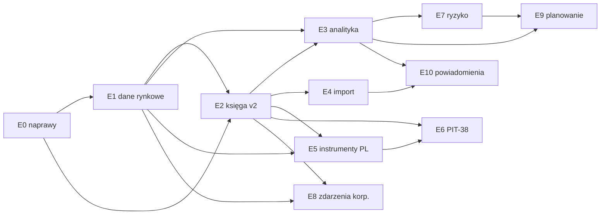

# Jak dojść od dzisiejszego FundTrackera do narzędzia lepszego niż myfund.pl?

Plan (L3) — **nie opisuje stanu systemu**; stan opisują dokumenty [L2](../technical/backend/01_backend-architecture.md) i kod. Podstawą planu są dowody L4 z 2026-10-01/02:

| Dowód | Co wnosi do planu |
|---|---|
| [myfund.pl — co oferuje i gdzie jest słaby](../research/competitors/01_myfund.md) | wzorzec zakresu funkcji (parytet) i lista słabości (przewaga) |
| [inne trackery — co przejąć](../research/competitors/02_trackery_porownanie.md) | najlepsze praktyki: metodologia PP, model danych Wealthfolio, import |
| [dane rynkowe PL i obligacje skarbowe](../research/03_rynek_pl_dane_i_obligacje.md) | źródła notowań, NBP, GUS, algorytmy wyceny EDO/COI |
| [podatki PL i formaty brokerów](../research/04_rynek_pl_podatki_i_brokerzy.md) | reguły PIT-38, FIFO, art. 11a, IKE/IKZE, eksporty XTB/mBank/IBKR… |
| [metodyka metryk](../research/05_metodyka_metryk.md) | TWR, XIRR, ryzyko, FIFO, snapshoty dzienne, testy złote |
| [stan FundTrackera vs cel](../research/06_stan_found-tracker_vs_cel.md) | defekty do naprawy (E0) i luki G1…G25 |

Szczegóły kroków: [etapy E0–E5](./03_roadmapa_etapy_E0-E5.md) · [etapy E6–E11](./04_roadmapa_etapy_E6-E11.md).

> **Status.** Plan jest szkicem (`draft`) do akceptacji przez właściciela. Kroki oznaczone „wymaga ADR” ruszają dopiero po zaakceptowaniu odpowiedniego ADR-a (agent nie przełącza ADR-ów na `Accepted`). Szacunki pracochłonności są orientacyjne **[wniosek]**.

## 1. Założenia od właściciela (rozmowa 2026-10-01)

| Pytanie | Decyzja | Konsekwencja dla planu |
|---|---|---|
| Dla kogo? | **Tylko ja** — self-hosted, jeden użytkownik | Bez planów płatnych, portfeli publicznych, subskrypcji, moderacji, forum. Rejestracja do zamknięcia (E0). `owner_id` zostaje — nie przeszkadza i chroni przed wyciekiem danych przy ewentualnym udostępnieniu instancji |
| Rynek | **PL-first + globalne** | Domyślnie PLN, GPW/NewConnect, TFI, obligacje skarbowe, IKE/IKZE/PPK, PIT-38, NBP; równolegle akcje/ETF zagraniczne i krypto |
| Dane rynkowe | **Darmowe źródła + ścieżka do płatnych** | Rejestr dostawców za portem; darmowe domyślnie (NBP, Stooq, Yahoo), płatny adapter jako opcja konfiguracyjna |
| Forma wyniku | **Dokumenty w repo** | Ten plan + 6 dokumentów L4; ADR-y powstają przy kroku, którego dotyczą |

## 2. Co znaczy „lepiej niż myfund” — zasady produktowe

myfund wygrywa **szerokością polskich przypadków brzegowych**; przegrywa **UX-em, przejrzystością metodologii, importem, API i paywallem** ([dowód](../research/competitors/01_myfund.md)). FundTracker nie ściga szerokości od pierwszego dnia — wygrywa jakością rdzenia, a szerokość dokłada etapami.

| # | Zasada | Odpowiedź na słabość myfund | Jak egzekwujemy |
|---|---|---|---|
| P1 | **Poprawność przed szerokością.** Każda liczba ma metodę, testy złote i oznaczenie jakości danych | wątki „skąd różnice”, „stopy zwrotu w milionach %”, błędne wyceny | testy złote z [metodyki](../research/05_metodyka_metryk.md); `data_quality` w odpowiedziach API |
| P2 | **Przejrzysta metodologia w UI** — przy każdej stopie zwrotu: metoda, okres, czy annualizowana, skąd kursy | myfund opisuje metodę skrótowo w FAQ | strona „Jak liczymy” + tooltipy; brak annualizacji < 1 roku (GIPS 2.A.12) |
| P3 | **Operacje są źródłem prawdy**, wszystko inne (pozycje, partie, snapshoty, podatek) da się odbudować | — | `rebuild()` dla każdej pochodnej; test idempotencji |
| P4 | **Import z podglądem i wycofaniem** — szkic → zatwierdzenie → partia importu do cofnięcia | „godziny ręcznego poprawiania raportów” | `import_batch`, wykrywanie duplikatów, zachowany surowy wiersz |
| P5 | **Pełne API (odczyt i zapis)** i eksport wszystkiego | API myfund: jeden endpoint read-only od 2025 | OpenAPI FastAPI jako kontrakt; token osobisty (E10) |
| P6 | **Nowoczesny, czytelny UI**, mobile-first dla przeglądania | „przeładowany, arkuszowy UI”, słabe mobile | progresywne ujawnianie: kokpit → portfel → walor → operacja; PWA (E11) |
| P7 | **Niezawodne dane**: wielu dostawców, retry, oznaczenie cen nieaktualnych, ręczne nadpisanie | braki notowań, dywidend (2 223 wątki „Usterki”) | rejestr dostawców z priorytetem (E1), flaga `is_synthetic` |
| P8 | **Wszystko dostępne** — brak planów i limitów | analizy i podatki tylko w Expert | single-user — brak paywalla z definicji |

## 3. Mapa etapów

Etapy są uporządkowane według zależności, nie według atrakcyjności. Każdy etap kończy się działającą, przetestowaną funkcją dostępną w UI.

| Etap | Nazwa | Co daje użytkownikowi | Parytet z myfund (plan) | Zależy od | Rozmiar **[wniosek]** |
|---|---|---|---|---|---|
| **E0** | Naprawy poprawności | wiarygodne liczby dla portfeli wielowalutowych; edycja operacji i dywidendy w UI | — (higiena) | — | M |
| **E1** | Dane rynkowe i historia | historia cen i kursów w bazie, NBP, GPW przez Stooq, wyszukiwanie po nazwie, benchmarki, odświeżanie w tle | notowania, wyceny dzienne | E0 | L |
| **E2** | Księga v2 | rachunki IKE/IKZE, gotówka wielowalutowa, nowe typy operacji, partie FIFO, zysk zrealizowany, snapshoty dzienne | operacje Basic | E0, E1 | XL |
| **E3** | Analityka podstawowa | TWR, XIRR, zysk w okresach, struktura, benchmark, kokpit, zamknięte pozycje, dywidendy | Basic/Standard | E1, E2 | L |
| **E4** | Import i eksport | CSV z mapowaniem, XTB, mBank, IBKR, DEGIRO, Trading212, Revolut; kopia zapasowa | Pro (import) | E2 | L |
| **E5** | Polskie instrumenty | obligacje skarbowe z automatyczną wyceną, TFI, PPK, lokaty, limity IKE/IKZE | Basic (PL) | E1, E2 | L |
| **E6** | Podatki PIT-38 | rozliczenie roczne FIFO z kursami NBP, dywidendy zagraniczne, krypto, straty, optymalizator | Expert (podatki) | E2, E5 (odsetki obligacji) | L |
| **E7** | Ryzyko i analityka zaawansowana | zmienność, Sharpe/Sortino, MDD, TUW, beta, VaR, efekt walutowy, kondycja portfela | Expert (statystyki, Snowball) | E3 | M |
| **E8** | Zdarzenia korporacyjne i dywidendy | splity bez przepisywania historii, prawa poboru, spin-off, zmiany tickera, kalendarz i prognoza dywidend | Basic/Pro | E2, E1 | L |
| **E9** | Planowanie | portfel wzorcowy, rebalancing, cele, FIRE, projekcje Monte Carlo, operacje cykliczne | Expert (wzorce, cele) | E3, E7 | M |
| **E10** | Powiadomienia i automatyzacja | alerty cenowe, raport e-mail, import z e-maila, token API, asystent AI na własnych danych | Pro (alerty) | E1, E3, E4 | M |
| **E11** | Jakość i eksploatacja | PWA, tryb prywatności, kopie automatyczne, audyt, wydajność | — (przewaga) | ciągle | ciągły |

**Kamienie milowe:**

| Kamień | Etapy | Kryterium |
|---|---|---|
| **M1 — używalny na co dzień** | E0–E3 | prowadzę w nim swoje rachunki (GPW + zagranica + IKE), widzę TWR/XIRR vs WIG, wartości zgadzają się z wyciągiem brokera ±0,01 zł |
| **M2 — parytet z myfund w zakresie PL** | + E4–E6 | importuję historię z brokerów, obligacje skarbowe wyceniają się same, PIT-38 zgadza się z PIT-8C (dla operacji krajowych) |
| **M3 — lepszy niż myfund** | + E7–E11 | pełna analityka ryzyka, planowanie, automatyczne zdarzenia korporacyjne, alerty, PWA |

## 4. Decyzje do podjęcia przed etapami (kandydaci na ADR)

Decyzje nieodwracalne lub zmieniające model danych. Każda ma rekomendację z dowodów; obowiązuje dopiero po ADR-ze zaakceptowanym przez właściciela.

| # | Decyzja | Rekomendacja | Alternatywy | Gdzie ADR | Blokuje |
|---|---|---|---|---|---|
| D1 | Czym jest Portfel względem rachunku maklerskiego? | **Portfel = jeden rachunek** (np. „XTB IKE”, „mBank zwykły”) z atrybutami `account_type` (zwykły/IKE/IKZE/PPK/OIPE) i `broker`; agregacja przez **Grupę portfeli** | myfund: portfel zawiera wiele kont (zagnieżdżenie) — bogatsze, ale trudniejsze w UI i w FIFO | biznesowy | E2.1, E6 |
| D2 | Koszt nabycia | **Partie zakupu FIFO jako dane pochodne** + średnia cena tylko do prezentacji; FIFO liczone w obrębie Portfela (= rachunku, D1) | sama średnia (dziś) — niezgodna z art. 24 ust. 10 | biznesowy | E2.4, E6 |
| D3 | Słownik: „partia zakupu” | dodać pojęcie **Partia** do [`CONTEXT.md`](../business/CONTEXT.md) (dziś „lot” jest na liście _Unikać_ z adnotacją „nie modelujemy lotów”) | „lot”, „transza” | biznesowy (+ CONTEXT) | E2.4 |
| D4 | Gotówka wielowalutowa | **saldo gotówki per (Portfel, Waluta)** + operacja przewalutowania | jedno saldo w walucie bazowej (dziś) | biznesowy | E2.2 |
| D5 | Kursy walut | **trzy kursy na zdarzenie**: brokera (faktyczny), wyceny (dzienny rynkowy/NBP), podatkowy (NBP tabela A z ostatniego dnia roboczego przed dniem przychodu/kosztu, art. 11a) | jeden kurs ręczny (dziś) | techniczny | E1.2, E2.3, E6 |
| D6 | Metodologia stóp zwrotu | **TWR dzienny (konwencja PP: wpływy na początku dnia, wypływy na końcu) + XIRR**; brak annualizacji < 365 dni; ryzyko z szeregu TWR | jednostki jak w funduszu (myfund) — matematycznie równoważne TWR | biznesowy | E3.1 |
| D7 | Historia cen i snapshoty | tabele `price_history` (cena niezależna od korekt, źródło, `is_synthetic`) i `portfolio_daily` / `position_daily` z unieważnianiem od daty zmiany | liczenie na żądanie z dostawcy (dziś) | techniczny | E1.1, E2.5 |
| D8 | Uruchamianie zadań w tle | **CLI `python -m app.cli <zadanie>` przez `entrypoints.py` + harmonogram systemowy** (cron/systemd timer/kontener) — zgodne z ADR-0002; opcjonalnie APScheduler w procesie | Celery/Redis — za ciężkie dla jednego użytkownika | techniczny | E1.4 |
| D9 | Model operacji | zachować **płaską Operację** z dodatkowymi polami (`settlement_date`, `currency_id`, `fx_rate_tax`, `counter_portfolio_id`, `import_batch_id`, `external_ref`) zamiast nagłówka z nogami (PP) | nagłówek + nogi (PP/Wealthfolio) — elastyczniejsze, ale większa migracja | techniczny | E2.3 |
| D10 | Moduły dla nowych obszarów | `imports`, `taxes`, `planning`, `notifications` jako nowe moduły; obligacje i szeregi (CPI, stopa NBP) w `assets`; wydajność/ryzyko w `portfolios` | jeden moduł „analytics” — zakazane nazewnictwo ([CONTEXT](../business/CONTEXT.md), sekcja Metryki) | techniczny | E4, E6, E9, E10 |
| D11 | numpy w obliczeniach ryzyka | trzymać wariant (a) [ADR-0005](../technical/adr/0005-warstwa-domeny.md): statystyki w `services/`, `domain/` tylko stdlib; float dla statystyk, `Decimal` dla księgi ([ADR-0010](../technical/adr/0010-decimal-i-precyzja-pieniedzy.md)) | numpy w domain | techniczny | E3, E7 |

## 5. Definicja ukończenia kroku (wspólna)

Każdy krok z [E0–E5](./03_roadmapa_etapy_E0-E5.md) i [E6–E11](./04_roadmapa_etapy_E6-E11.md) jest skończony, gdy:

1. Backend: zgodny z architekturą (warstwy, `wiring.py`, `transaction()`, błędy z `code`, `Decimal`, `extra="forbid"`); test architektury zielony.
2. Migracje wyłącznie `alembic revision --autogenerate`; `alembic check` bez dryfu; model w `models_registry.py`.
3. Testy: jednostkowe domeny (bez bazy) z **testami złotymi** z dokumentów L4; integracyjne endpointów; dla obliczeń — testy własności (np. zysk całkowity FIFO = średnia).
4. `ruff check .`, `ruff format --check .`, `mypy app`, `pytest` zielone; frontend `npm run lint`, `npm run build`.
5. Funkcja dostępna w UI (nie tylko w API), z obsługą stanu pustego, błędu i ładowania.
6. Dokumentacja: aktualizacja dokumentu modułu L2 (tabela „Stan vs cel”), nowe pojęcia w `CONTEXT.md`, wpis w mapie wiedzy, `kb_validate --strict` bez nowych błędów.
7. Zero regresji w testach parytetu `portfolios/tests/unit/test_ledger_parity.py` — chyba że krok świadomie zmienia regułę (wtedy ADR i aktualizacja testu w tym samym kroku).

## 6. Ryzyka

| Ryzyko | Wpływ | Mitygacja |
|---|---|---|
| Darmowi dostawcy (Yahoo, Stooq) zmieniają lub blokują API | brak cen, błędne wykresy | rejestr dostawców z priorytetem i fallbackiem; cache w bazie; ręczne ceny; płatny adapter jako opcja (E1) |
| Licencje danych GPW przy redystrybucji | ryzyko prawne przy udostępnianiu | single-user, użytek własny; nie publikujemy danych dalej ([dowód](../research/03_rynek_pl_dane_i_obligacje.md)) |
| Błędna interpretacja przepisów podatkowych | błędne PIT-38 | eksport oznaczony „szkic do weryfikacji”; testy na przykładach z broszury MF i PIT-8C; cytaty przepisów w kodzie i dokumentach |
| Rozrost E2 (największa zmiana modelu) | opóźnienie wszystkiego | podział na kroki E2.1–E2.6, każdy z migracją addytywną i zielonymi testami parytetu |
| Zmiana metodologii liczb po wdrożeniu | utrata zaufania do historii | ADR D6 przed E3; wersjonowanie metody w odpowiedzi API (`method`) |
| Wydajność przeliczeń dziennych na długiej historii | wolne wykresy | snapshoty z unieważnianiem od daty (D7); pomiar na 10 latach × 200 operacji |
| Praca jednoosobowa (bus factor) | porzucenie | małe kroki, dokumentacja L2 na bieżąco, eksport danych w otwartym formacie (E4.5) |

## 7. Poza zakresem (świadomie)

Portfele publiczne i subskrybowane, forum, ranking funduszy, skaner spółek z ponad 100 wskaźnikami, analiza fundamentalna, sygnały AT/strategie transakcyjne, kontrakty terminowe i Forex/CFD, pożyczki społecznościowe, nieruchomości z najmem, budżet domowy, synchronizacja z bankami przez PSD2. Każdą z nich można wrócić do planu osobnym wpisem — myfund ma je głównie jako funkcje dla szerokiej bazy płacących użytkowników ([dowód](../research/competitors/01_myfund.md)).

## 8. Kolejne kroki po akceptacji planu

1. Właściciel akceptuje lub zmienia decyzje D1–D11; agent przygotowuje ADR-y `Proposed` dla wybranych (biznesowe w `docs/business/adr/`, techniczne w `docs/technical/adr/`).
2. Start od **E0** — naprawy nie wymagają nowych ADR-ów, a usuwają defekty, które zafałszowałyby każdą późniejszą metrykę.
3. Po każdym etapie: przegląd planu (ten plik) — przesunięcia kolejności zapisuje się tutaj, stan systemu w L2.
